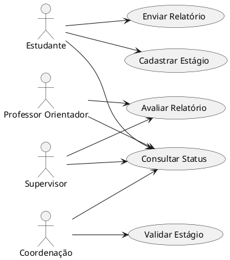

## Diagrama de Casos de Uso

## Casos de Uso

### Descrição:

- **Cadastrar Estágio** — registrar um novo estágio vinculando estudante, empresa, professor orientador e supervisor.
- **Enviar Relatório** — submeter relatório periódico vinculado a um estágio.
- **Avaliar Relatório** — analisar e definir o status do relatório (aprovado/reprovado).
- **Validar Estágio** — validar e alterar o status do estágio (em andamento/concluído/cancelado).
- **Consultar Status** — consultar o andamento de estágios e relatórios.

### Cadastrar Estágio

* Atores:

	- Estudante
	- Sistema

- Pré-Condições:
	- Estudante, Empresa, Professor Orientador e Supervisor já cadastrados.
	- Usuário autenticado.

* Fluxo Básico:
    1. Estudante informa tipo do estágio, carga horária, empresa, professor orientador e supervisor
    2. Sistema valida os dados (carga horária positiva; supervisor pertencente à empresa informada)
    3. Sistema persiste o estágio com status inicial "em andamento"
    4. Sistema retorna o estágio criado

- Fluxos Alternativos:
	- 2a. Carga horária inválida (≤ 0)
		- 2a1. Sistema retorna erro de validação
	- 2b. Supervisor não pertence à empresa informada
		- 2b1. Sistema retorna erro de validação

### Enviar Relatório

- Atores:
	- Estudante
	- Sistema

- Pré-Condições:
	- Estágio cadastrado.
	- Usuário autenticado.

- Fluxo Básico:
    1. Estudante informa a data de envio e o estágio relacionado
	2. Sistema persiste o relatório com status inicial "pendente"
	3. Sistema retorna o relatório criado

- Fluxos Alternativos:
	- 1a. Estágio inexistente
		- 1a1. Sistema retorna erro de validação

### Avaliar Relatório

- Atores:
	- Professor Orientador / Supervisor
	- Sistema

- Pré-Condições:
	- Relatório enviado (status "pendente").
	- Usuário autenticado.

- Fluxo Básico:
	1. Avaliador consulta o relatório pendente
	2. Avaliador define o status como "aprovado" ou "reprovado"
	3. Sistema persiste a alteração de status
