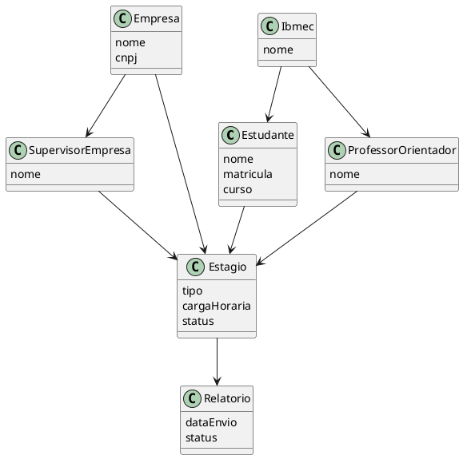

```plantuml
@startuml
class Estudante {
  nome
  matricula
  curso
}

class Ibmec {
  nome
}

class Empresa {
  nome
  cnpj
}

class ProfessorOrientador {
  nome
}

class SupervisorEmpresa {
  nome
}

class Estagio {
  tipo
  cargaHoraria
  status
}

class Relatorio {
  dataEnvio
  status
}

Ibmec --> Estudante
Ibmec --> ProfessorOrientador

Empresa --> SupervisorEmpresa
Empresa --> Estagio

Estudante --> Estagio
ProfessorOrientador --> Estagio
SupervisorEmpresa --> Estagio

Estagio --> Relatorio
@enduml
```