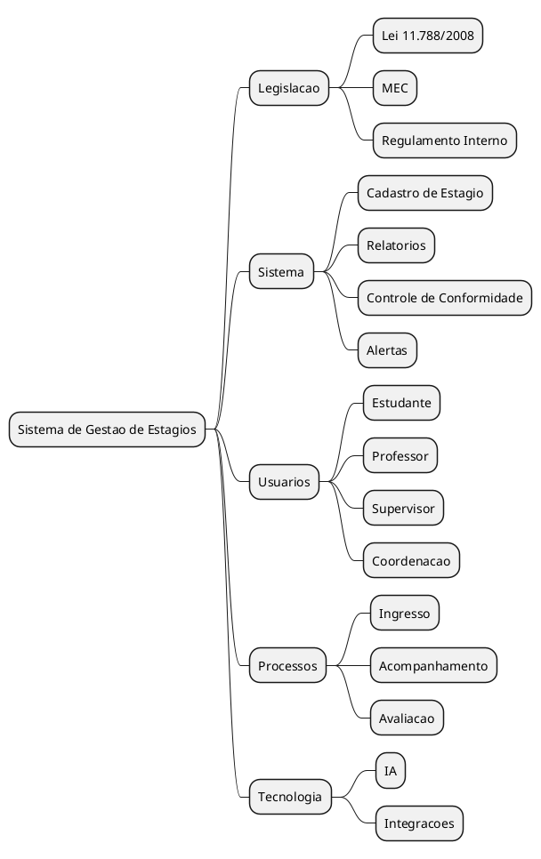

# Mapa Mental

O mapa mental consolida os principais eixos do projeto: legislacao, requisitos, atores, processos e validacao de relatorios.

## Contexto

O artefato foi construido para organizar visualmente os pontos centrais do sistema de gestao de estagios e facilitar a comunicacao entre problema, regras e fluxo operacional.

## Estrutura representada

- base legal e institucional
- requisitos funcionais do sistema
- atores envolvidos no processo
- fluxo de avaliacao e validacao
- referencias de benchmark e apoio

## Mapa visual

## Fonte em PlantUML

O rascunho textual utilizado como base para o mapa esta em [mapa_mental.puml](mapa_mental.puml).

