## Introdução

Este protótipo de baixa fidelidade mostra o fluxo de um sistema de gestão de estágios para IBMEC, com telas claras e objetivas. A proposta é ser simples, funcional e direto, com foco nas funcionalidades essenciais para o estudante, o professor orientador e o supervisor da empresa.

## Estrutura do protótipo

- Autenticação e cadastro de usuários
- Cadastro e acompanhamento de estágio
- Envio e avaliação de relatórios
- Visualização do perfil e histórico

## Telas em PlantUML

### 1. Tela de Login

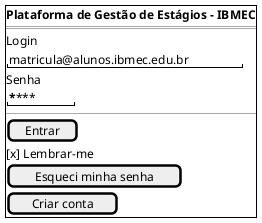

### 2. Tela de Cadastro de Usuário

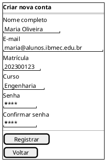

### 3. Tela Recuperar Senha

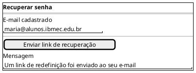

### 4. Dashboard do Aluno

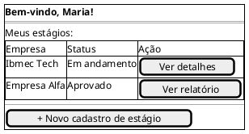

### 5. Dashboard do Orientador / Supervisor

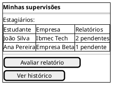

### 6. Formulário de Estágio

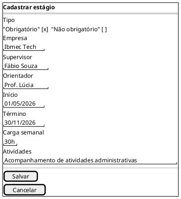

### 7. Tela de Detalhes do Estágio

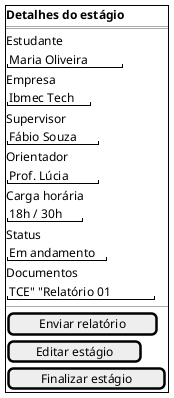

### 8. Tela de Envio de Relatório

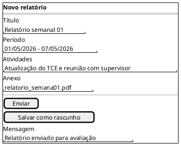

### 9. Tela de Avaliação de Relatório

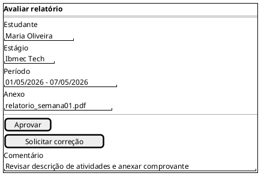

### 10. Tela de Perfil do Usuário

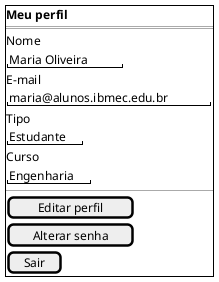

## Visão simplificada do fluxo em PlantUML

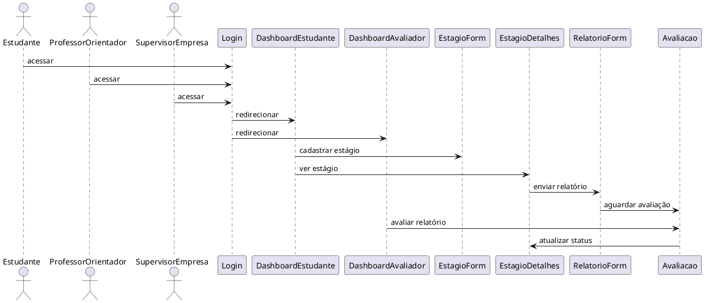

## Observações importantes

- O protótipo privilegia a clareza das ações e a hierarquia de informações.
- As telas foram desenhadas para facilitar o trabalho do estudante, do orientador e do supervisor.
- O fluxo de aprovação de relatórios é central para a conformidade do estágio.

## Conclusão

O documento agora apresenta um protótipo de baixa fidelidade mais enxuto, organizado e fácil de entender. Ele mantém o foco nas funcionalidades essenciais e melhora a leitura em relação ao modelo inicial.

## Autor(es)

| Data     | Versão | Descrição                                   | Autor(es) |
| -------- | ------- | ------------------------------------------- | --------- |
| 16/04/2026 | 1.1   | Protótipo de baixa fidelidade revisado | Caio Cunha Dantas |
